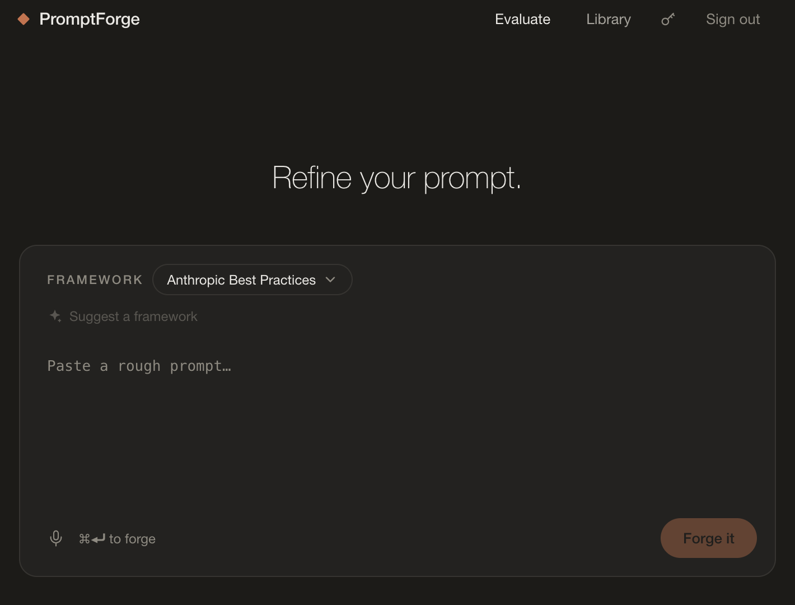

# PromptForge

> Turn a rough prompt into a scored, framework-conformant, reusable one.

[](https://github.com/AshutoshRavindraIwale/promptforge/actions/workflows/ci.yml)
[](LICENSE)


Paste a draft prompt, pick a framework, and one structured Claude call grades it dimension by
dimension — streaming the scorecard in as it's written — then returns a priority fix and a
ready-to-use rewrite. Save the result to a searchable library, refine it again, or test the
original and the rewrite side by side on real input.



Twelve frameworks ship built in, spanning chat prompts, agent artifacts, and generated media:

| Framework | For |
|---|---|
| **Anthropic Best Practices** | General-purpose prompts (the default) |
| **CO-STAR** | Balanced, on-brand outputs |
| **RTF / RISEN** | Lightweight task-focused prompts |
| **CRISPE** | Persona-driven prompting |
| **Chain-of-Thought** | Hard reasoning tasks |
| **Healthcare** | Clinical and patient-facing prompts — audience, safety boundaries, evidence grounding |
| **Agent System Prompt** | The standing instructions that define an agent — role, tools, guardrails, stop conditions |
| **Agent Task Brief** | A kickoff spec an autonomous agent can run with — goal, constraints, done-criteria |
| **Tool Description** | Docs a model picks the right tool from — trigger conditions, parameters, return contract |
| **Image Generation** | A generated still image (Midjourney, DALL·E, Stable Diffusion, Flux) |
| **Cinematic Video** | Single AI-video clips (Sora, Veo, Runway, Kling) |
| **Video Narrative** | Multi-shot sequences and storyboards |

New to this? The app ships a plain-language walkthrough at **`/how-to-use`** — what a framework
is, what the grades mean, and the full loop from draft to saved prompt. It needs no account, so
you can read it before signing in.

## Example

Draft, scored with the default framework:

```
Write a summary of this article.
```

| Dimension  | Score      | Fix                                                |
|------------|------------|----------------------------------------------------|
| Clarity    | Poor       | Name the audience and the target length.           |
| Guidelines | Needs Work | State what to include vs. omit (e.g. no opinions). |
| Structure  | Good       | Ask for headed sections or bullets.                |
| Examples   | Poor       | Show one sample summary in the desired style.      |

**Overall: Needs Work** — a Poor on a required dimension caps the total.

**Rewrite:** *"Summarize the article below for a technical audience in 120–150 words.
Cover the core claim, the evidence, and one limitation. Neutral tone, no opinions.
Output as 3–4 sentences, no heading."*

## Features

- **Framework-aware scoring** — each framework defines its own rubric; every dimension gets a
  grade, an assessment, and one actionable fix, plus a single priority fix and a deterministic
  overall grade computed server-side, never by the model.
- **Streaming results** — the scorecard fills in row by row while the model writes; the revised
  prompt types itself out. No blank 20-second wait.
- **Refine loop** — re-score the rewrite, optionally telling the model what to focus on next pass.
- **Side-by-side test** — run the original and revised prompt on the same input and judge the
  rewrite by its output, not just its score.
- **Library** — save, search, and filter prompts by category; `[PLACEHOLDER]` templates can be
  filled in and copied. Per-user isolation via Supabase Row-Level Security.
- **Bring your own key** — an in-app Settings dialog stores per-browser Anthropic/Groq keys, so a
  deployed instance doesn't have to spend the server's quota.
- **Voice dictation** — a mic button transcribes straight into the draft (Whisper via Groq).
- **Open in your chat app** — hand a finished prompt to Claude, ChatGPT, Perplexity, or Gemini.

## Quick start

You need [Node 20+](https://nodejs.org), a free [Supabase](https://supabase.com) project, and
5 minutes. An [Anthropic API key](https://console.anthropic.com/settings/keys) can live on the
server or be pasted into the app later — your choice.

```bash
git clone https://github.com/AshutoshRavindraIwale/promptforge.git
cd promptforge/frontend
npm install
cp .env.example .env.local
```

1. **Create a Supabase project** at [database.new](https://database.new) (any name, free tier).
2. **Fill `.env.local`** — three values are required:
   - `NEXT_PUBLIC_SUPABASE_URL` and `NEXT_PUBLIC_SUPABASE_ANON_KEY` — from your Supabase
     dashboard under **Settings → API**.
   - `ALLOWED_EMAILS` — the email address you'll sign in with. This gates the routes that spend
     API money and **fails closed** if unset.
3. **Create the database table** — open the Supabase **SQL Editor**, paste the contents of
   [`frontend/supabase/schema.sql`](frontend/supabase/schema.sql), and run it.
4. **Run it:**

   ```bash
   npm run dev
   ```

5. Open <http://localhost:3000> and sign in with **email magic link** — it works on a fresh
   Supabase project with zero auth configuration. (The Google button needs an OAuth provider
   configured in Supabase; skip it for now.)
6. Forge a prompt. If you didn't set `ANTHROPIC_API_KEY` in `.env.local`, click the key icon in
   the header and paste your key there instead.

Full configuration, deployment, and troubleshooting: [`frontend/README.md`](frontend/README.md).

## Repository layout

```
frontend/               the app — Next.js 16, React 19, Tailwind v4, Supabase
  lib/frameworks.ts     the twelve frameworks; adding one is data-only, no engine changes
  lib/engine.ts         one structured Claude call: score + rewrite
  lib/scoring.ts        deterministic overall grade (required-dimension cap)
  supabase/schema.sql   the database schema — paste into Supabase's SQL editor
backend/                the original Python CLI prototype (see below)
docs/                   product requirements document
```

## The Python CLI (legacy)

PromptForge started as a terminal REPL (`backend/`, Python + LangChain): paste a draft, get the
scorecard and rewrite, save to a local JSON file. It still works, but it predates frameworks —
it scores the original fixed four-dimension rubric only — and the web app has long since forked
ahead. Kept for reference and for its scoring-logic unit tests:

```bash
python3 -m venv .venv && source .venv/bin/activate
pip install -r backend/requirements.txt
cp backend/.env.example backend/.env   # add your Anthropic key
cd backend && python -m promptforge    # run the REPL
pytest tests/                          # or run the tests
```

## Security

- The server's Anthropic key is read only server-side (never `NEXT_PUBLIC_`), so it never
  reaches the browser. User-supplied keys from Settings stay in that browser's local storage.
- The paid API routes require a signed-in **and** allowlisted user, and fail closed.
- Supabase Row-Level Security scopes every library row to its owner; the anon key shipped to
  the browser is public by design.
- No secrets are committed — `.env*` is git-ignored; only `.env.example` templates are tracked.

## Roadmap

- Video-tool hand-off — send a finished Sora/Veo/Runway prompt to the tool the way chat prompts
  hand off today
- Custom framework builder — define your own rubric as data
- Refine-chain history with score movement between versions

## License

[MIT](LICENSE) © Ashutosh Iwale
