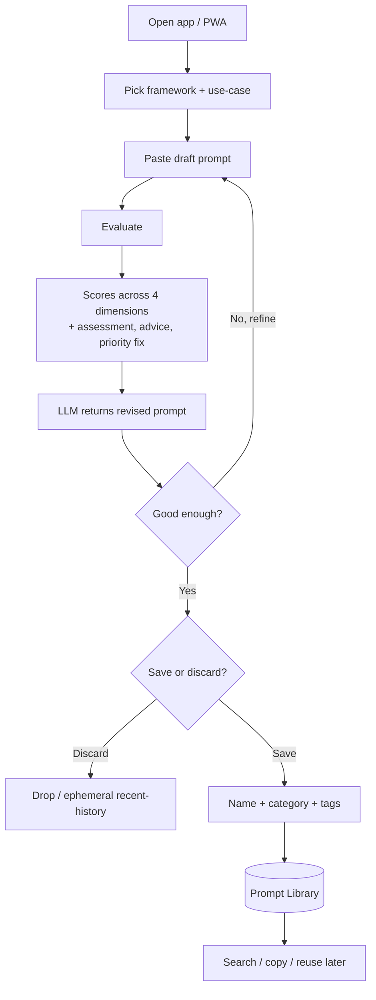
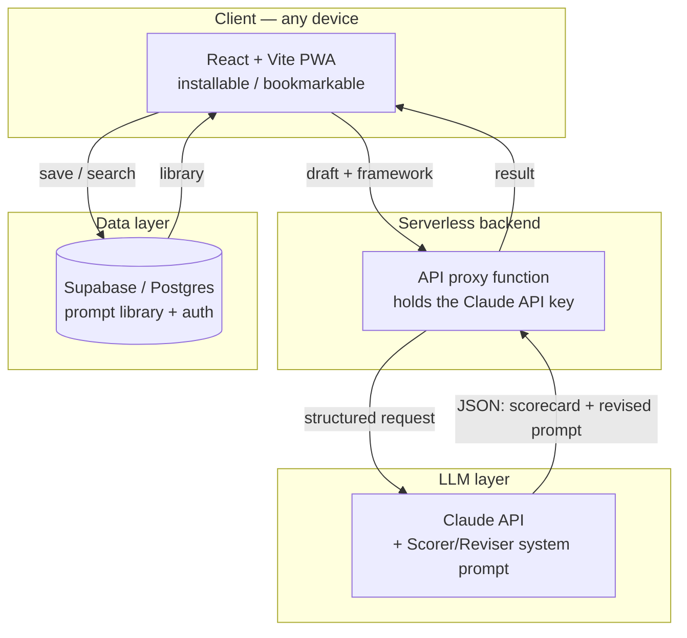

# PromptForge — Product Requirements Document

> *Working title — alternatives: Refyne, Promptsmith, Anvil. A personal, cross-device tool that turns rough prompts into scored, framework-conformant, reusable ones.*

**Owner:** Ashutosh Iwale  ·  **Status:** Concept → PRD  ·  **Phase 1 scope:** LLM chat-based interface (agentic mode explicitly out of scope)

---

## 1. The gist

PromptForge is a single-user web app that closes the loop between *"I have a rough prompt"* and *"I have a sharp, reusable prompt."* You paste a draft; an LLM (driven by a fixed scorer/reviser system prompt) scores it on four dimensions, explains each score, gives one actionable fix per dimension, and returns a rewrite that conforms to a framework you choose. You then decide its fate: **save** it (named, categorized, reusable) or **discard** it (one-off, not worth keeping). Over time you build a clean, searchable personal prompt library — and a feedback loop that quietly makes you better at prompting.

**The core loop is the product.** Everything else is plumbing around it.



**Design principle:** reward **clarity, not length.** Structure (XML) and examples are added *only when the task warrants them* — a simple, unambiguous prompt that correctly omits them should still score well.

---

## 2. Who it's for & why it exists

**Primary user:** you — a heavy, repeat AI user whose prompt quality is uneven and whose good prompts currently live nowhere reusable. **Problem:** (1) you can't tell *why* a weak prompt is weak, (2) rewriting by hand is slow, (3) the good ones evaporate after one use. PromptForge fixes all three in one loop.

**Non-goals (now):** not a multi-tenant SaaS, not an agent that runs prompts against models for you, not a team/collaboration tool. Single user, single purpose, cheap to run.

---

## 3. The scoring rubric (4 dimensions)

Each dimension is scored on a 4-point ordinal scale: **Poor · Needs Work · Good · Excellent.** Dimensions 2–4 are **conditional** — they apply only when the task calls for them. A prompt that correctly omits steps, XML, or examples because it doesn't need them is *not penalized*; it scores well for making the right call.

| # | Dimension | Question it answers | When it matters most |
|---|---|---|---|
| 1 | **Clarity** | Is the prompt clear and direct? | **Always.** Task, context, format, and constraints stated with no ambiguity. |
| 2 | **Guidelines** | Does it include steps/rules when needed? | Multi-step or ordered tasks, quality criteria, repeatable workflows, output-drift risk. |
| 3 | **Structure** | Does it use XML tags when appropriate? | Multiple distinct components, long/complex inputs, conditional logic, reusable templates. |
| 4 | **Examples** | Does it include examples when needed? | Hard-to-define style/voice, non-standard output format, judgment calls, cross-run consistency. |

**Overall score:** the average sentiment across the four dimensions, expressed on the same scale (Poor → Excellent). A practical mapping for computation: Poor = 1, Needs Work = 2, Good = 3, Excellent = 4 → average → round to the nearest band.

**Priority fix:** alongside the overall score, the engine names the *single* most impactful change to make first — so you always know where to start, even when several dimensions are weak.

---

## 4. Frameworks ("the framework I'll define")

The revised prompt is generated *to conform to a framework you select.* This is a first-class, pluggable concept.

- **Default framework — Clear / Guided / Structured / Exampled:** the same four principles the rubric scores, applied as rewrite targets. The reviser makes the prompt clear and direct, adds explicit guidelines when the task is multi-step, wraps components in XML tags when the prompt is complex, and adds examples when the task involves style or judgment — and *skips* structure/examples when they'd be needless overhead. Honors "clarity, not length."
- **Built-in alternatives (add-on):** the tiered Intent/Context/Variables/Constraints/Output structure (from your prompt-structurer), plus common public templates — CRISPE, RTF (Role-Task-Format), RACE — useful for comparison.
- **Custom frameworks (add-on):** you define a named template with your own ordered fields; the reviser conforms to it. This is what lets the tool grow with your workflows (e.g. a "NANDA technical-challenge prompt" template).

MVP ships **one** framework (the Clear/Guided/Structured/Exampled default), done well. Multi-framework is Phase 3.

---

## 5. The engine: the LLM system prompt

The scorer **and** reviser are one LLM call driven by a fixed system prompt. Canonical version — drop in as-is:

```text
<knowledge_base>

DIMENSION 1 — CLARITY (Is the prompt clear and direct?)
A clear and direct prompt tells the model exactly what is wanted — the task, the
context, the format, and any constraints — with no ambiguity or room for
misinterpretation. It removes guesswork by specifying the goal, audience, tone, and
expected output structure.
Key ingredients: task (what to do), context (background or input), format (how to
structure output), constraints (length, tone, audience).
Bad example: "Write something about climate change."
Good example: "Write a 3-paragraph explainer on the economic costs of climate change
for a non-technical audience. Use a neutral, factual tone. End with one concrete
statistic."

DIMENSION 2 — GUIDELINES (Does the prompt include steps or rules when needed?)
Guidelines are explicit instructions that constrain how the model should approach or
execute a task — not just what to produce, but how to produce it. They are needed
when: the task has multiple sub-tasks in a specific order, quality criteria must be
met, there is risk of output drift, or the workflow needs to be repeatable.
Bad example: "Analyze this user interview transcript."
Good example: "Analyze this user interview transcript. Follow these steps: 1. Identify
the top 3 pain points. 2. Note any implied unmet needs. 3. Flag quotable quotes. 4.
Rate overall sentiment: Positive / Neutral / Negative. 5. Output each section with a
bold header."

DIMENSION 3 — STRUCTURE (Does the prompt use XML tags when appropriate?)
XML tags wrap different parts of a prompt (context, task, data, examples) into clearly
labeled sections. They are appropriate when the prompt has multiple distinct
components, long or complex inputs, conditional logic, or is a reusable template. For
short single-task prompts, XML is unnecessary overhead.
Bad example (multi-part prompt with no structure): "You are a policy analyst. Here is
the document [paste]. Summarize it in 3 bullets for small businesses. Max 100 words.
No jargon."
Good example:
<role>You are a policy analyst writing for a non-technical audience.</role>
<document>[paste document here]</document>
<task>Summarize in 3 bullet points. Focus on impact to small businesses.</task>
<constraints>Max 100 words. Avoid legal jargon.</constraints>

DIMENSION 4 — EXAMPLES (Does the prompt include examples when needed?)
Examples act as behavioral anchors — they show the model what "correct" looks like.
Use examples when: the task has a specific style or voice hard to define abstractly,
the output format is non-standard, the task involves judgment calls (classification,
scoring, labeling), or consistency across runs matters. Do not use examples when the
task is simple and unambiguous.
Bad example (classification with no anchor): "Classify this customer feedback as
Positive, Neutral, or Negative."
Good example:
<instruction>Classify the customer feedback as Positive, Neutral, or Negative.</instruction>
<examples>
  <example><input>Late delivery but great product quality.</input><output>Neutral</output></example>
  <example><input>Terrible experience, never ordering again.</input><output>Negative</output></example>
</examples>
<input>[paste feedback here]</input>

</knowledge_base>

<task>
Evaluate the following prompt across all four dimensions. For each dimension:
1. Assign a score: Poor / Needs Work / Good / Excellent
2. Write 1–2 sentences explaining why you gave that score
3. Provide 1 specific, actionable piece of advice to improve it

Then provide an Overall Score (average sentiment across all four) and a Priority Fix —
the single most important change the user should make first.

Finally, produce a Revised Prompt that incorporates all the improvements identified in
the scorecard. Rewrite the full prompt — do not summarize or describe the changes, just
output the improved prompt ready to use as-is.
</task>

<output_format>
Return your evaluation in exactly this structure:

---
PROMPT EVALUATED:
[repeat the user's prompt here]

---
SCORECARD:

[1] CLARITY
Score: [Poor / Needs Work / Good / Excellent]
Assessment: [1–2 sentences]
Advice: [1 specific improvement action]

[2] GUIDELINES
Score: [Poor / Needs Work / Good / Excellent]
Assessment: [1–2 sentences]
Advice: [1 specific improvement action]

[3] STRUCTURE
Score: [Poor / Needs Work / Good / Excellent]
Assessment: [1–2 sentences]
Advice: [1 specific improvement action]

[4] EXAMPLES
Score: [Poor / Needs Work / Good / Excellent]
Assessment: [1–2 sentences]
Advice: [1 specific improvement action]

---
OVERALL SCORE: [Poor / Needs Work / Good / Excellent]
PRIORITY FIX: [The single most impactful change to make first, in 1–2 sentences]

---
REVISED PROMPT:
[The full rewritten prompt, ready to use as-is]
</output_format>
```

### Implementation notes

- **Don't penalize correct omission.** Dimensions 2–4 are conditional. Add this line to the SCORE instructions so the model doesn't mark a deliberately simple prompt as Poor on Structure/Examples: *"If a conditional dimension (Guidelines, Structure, Examples) is genuinely not needed for this task and is correctly absent, score it Good or Excellent — do not penalize a prompt for omitting what it doesn't need."*
- **JSON variant for the app UI.** The text scorecard above is great for reading, but the web app needs to render scores into UI components. For the app, instruct the same logic to return **only** this JSON (keeps parsing trivial and feeds the save/categorize step). `score` ∈ `"Poor" | "Needs Work" | "Good" | "Excellent"`.

```json
{
  "prompt_evaluated": "",
  "scorecard": {
    "clarity":    {"score": "", "assessment": "", "advice": ""},
    "guidelines": {"score": "", "assessment": "", "advice": ""},
    "structure":  {"score": "", "assessment": "", "advice": ""},
    "examples":   {"score": "", "assessment": "", "advice": ""}
  },
  "overall_score": "",
  "priority_fix": "",
  "revised_prompt": "",
  "suggested_category": "",
  "suggested_tags": [""]
}
```

`suggested_category` and `suggested_tags` are app-level additions (not in the canonical text format) that pre-fill the save step, so categorizing is one tap. Tune this prompt against 5–10 of your real prompts before writing any UI — it's the highest-leverage hour in the whole build.

---

## 6. User stories

- As a user, I paste a draft and get an overall score, so I instantly know if it's worth using as-is.
- As a user, I see a per-dimension breakdown — score + a one-sentence assessment + one concrete fix — so I know *what* is weak and *how* to fix it, not just *that* it's weak.
- As a user, I get a single priority fix, so I know which change to make first when several things are weak.
- As a user, I get an automatically revised prompt that follows my chosen framework, so I can use it immediately.
- As a user, I pick which framework the rewrite should follow, so output matches my workflow.
- As a user, I can re-evaluate the revised prompt and refine again, so I can loop until it's strong.
- As a user, after each result I decide **save** or **discard**, so my library stays clean and intentional.
- As a user, when I save I name it, assign a category, and add tags, so I can find reusable prompts later.
- As a user, I can search/filter my library and copy any prompt to clipboard in one tap, so reuse is frictionless.
- As a user, I open the same app and library from my phone and my laptop, so it's available wherever I'm working.

---

## 7. User journey

1. **Open** the app (bookmarked tab on laptop, installed PWA icon on phone).
2. **Configure** the run: choose framework (default pre-selected) and optionally a use-case/target model.
3. **Paste** the draft prompt.
4. **Evaluate** → one LLM call.
5. **Review** the four scores — each with an assessment + one fix — plus the overall score and the priority fix.
6. **Read** the revised prompt (with a before/after view in later phases).
7. **Decide:**
   - **Refine** → feed the revision back into step 3 and re-score (the loop).
   - **Save** → name it, accept/edit the suggested category + tags → lands in the Library.
   - **Discard** → dropped (or kept briefly in an ephemeral "recent" list that auto-clears).
8. **Reuse** later: open Library → search/filter → copy → paste into whatever model you're using.

---

## 8. Features: MVP vs add-on

### MVP (the loop, end to end)
- Single-screen, chat-style input for the draft prompt.
- One framework: the Clear/Guided/Structured/Exampled default, well-implemented.
- Four-dimension scoring (Clarity / Guidelines / Structure / Examples) on the Poor→Excellent scale, each with a one-sentence assessment + one actionable fix.
- Overall score + a single priority fix.
- Auto-generated revised prompt conforming to the framework.
- **Save / Discard** decision after every result.
- On save: name + single category + free-text tags (pre-filled from the LLM's suggestions).
- Basic Library list: see saved prompts, copy-to-clipboard, delete.
- Re-evaluate button (paste-the-revision loop — even if manual at first).
- Responsive layout that works in a phone browser.
- Secure LLM call (API key server-side, never in the browser).

### Add-on (post-MVP, roughly in priority order)
- **Persistent + synced library** (move from local storage to a hosted DB so phone & laptop share one library).
- **Search, filter by category/tag, favorites.**
- **One-click loop**: re-score the revised prompt without re-pasting + a before/after diff view.
- **Version history** per prompt (every revision kept, restorable).
- **Multiple frameworks + a custom-framework builder.**
- **PWA install + auth** (so it's a real "app" on your devices, library gated behind login).
- **Export / import library** as JSON (backup + portability).
- **Templated prompts with `[PLACEHOLDER]` variables** you can fill at reuse time.
- **Usage analytics**: most-reused prompts, score trends over time.
- **Model-specific tuning** (Claude vs GPT vs Gemini phrasing tweaks).
- **Browser extension** — the elevated version of "bookmark to Chrome": highlight text on any page → score/rewrite in a side panel.
- *(Out of scope now)* **Agentic mode:** auto-run prompts against target models, prompt chaining, an eval harness that A/B-tests revisions.

---

## 9. Architecture (Phase 1)



**Recommended stack (opinionated, budget-friendly):**

| Layer | Choice | Why |
|---|---|---|
| Frontend | React + Vite + TypeScript + Tailwind, PWA-enabled | Fast, installable on phone, bookmarkable on desktop — covers "accessible anywhere" |
| LLM | Anthropic Claude API (Sonnet for the cost/quality balance) | You're already in this ecosystem; one structured JSON call does score + rewrite |
| Backend | One serverless function (AWS Amplify/Lambda — you already run Amplify for NITA) | Keeps the API key off the client; near-zero cost at personal volume |
| Storage | Browser `localStorage` for MVP → Supabase (Postgres + Auth) for sync | Start free and simple; graduate to synced + gated when you want phone/laptop parity |
| Hosting | AWS Amplify (reuse your existing skills) — Vercel as the simpler alternative | One deploy, free tier, custom domain you can bookmark |

**Non-negotiable:** the Claude API key lives only in the serverless function, never in frontend code.

---

## 10. Build roadmap (from scratch)

**Phase 0 — Define (1–2 days).** Lock the four-dimension rubric, the Poor→Excellent scale (including the don't-penalize-omission rule), and the default framework. Write the system prompt and test it in the Claude console against 5–10 of your real prompts until (a) the output is stable and (b) the rewrites are genuinely better. *Do not write UI before this feels right.*

**Phase 1 — MVP loop (1–2 weeks).** Scaffold React + Vite. Build the single screen: input → Evaluate → scorecard + revised prompt → Save/Discard. Add the serverless proxy for the Claude call (use the JSON variant of the prompt). Persist saves to `localStorage`. Deploy to Amplify, bookmark it, **dogfood for a week.**

**Phase 2 — Library & categories (~1 week).** Stand up Supabase, migrate saves to it, add categories + tags + search + copy + edit. Let your real week-of-usage tell you what categories you actually need (don't pre-invent them).

**Phase 3 — Frameworks & loop polish (1–2 weeks).** Multiple built-in frameworks + a custom-framework builder. One-click re-score, before/after diff, version history.

**Phase 4 — Cross-device (a few days).** PWA install, Supabase Auth (magic link), library gated + synced across phone and laptop.

**Phase 5 — Agentic (out of scope now).** Auto-run against target models, chaining, eval harness. Revisit once the loop is a daily habit.

### Start this week
1. Finalize the four-dimension rubric + Poor→Excellent scale + default framework (Phase 0).
2. Paste the system prompt into the Claude console; run your 5–10 real prompts through it; tune until the scorecard is consistent and the rewrites impress you.
3. Scaffold the Vite app; build the loop screen with `localStorage` only.
4. Add the serverless proxy; wire Evaluate to Claude using the JSON variant.
5. Ship to Amplify, bookmark it, use it for a week, then design categories from what you actually saved.

---

## 11. Open decisions (flag for yourself)

- **Overall computation:** how to average four ordinal scores — should a single **Poor** on a *required* dimension (Clarity or Guidelines) cap the overall lower than a plain mean would? *(Recommend: a required-dimension Poor caps the overall at "Needs Work" max, so a clear-but-flawed prompt can't read as "Good.")*
- **Conditional dimensions in the average:** when Structure/Examples are correctly omitted, count them as Excellent, or exclude them from the average entirely? *(Recommend: score Excellent and include — simpler, and rewards making the right call.)*
- **Discarded prompts:** vanish entirely, or sit in an auto-clearing "recent" list for a day? *(Recommend the recent list — you'll occasionally want one back.)*
- **Categories:** fixed taxonomy (Coding / Writing / Research / Ops…) vs free-form tags only? *(Recommend one category + free tags — structure without rigidity.)*
- **Auth in MVP:** skip it (single device, localStorage) and add only when you want sync? *(Recommend yes — defer auth to Phase 4.)*
